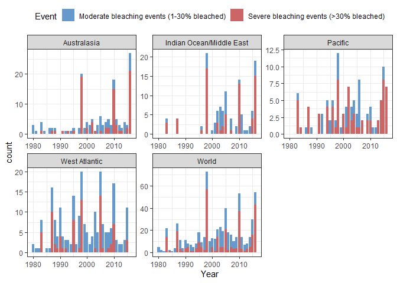
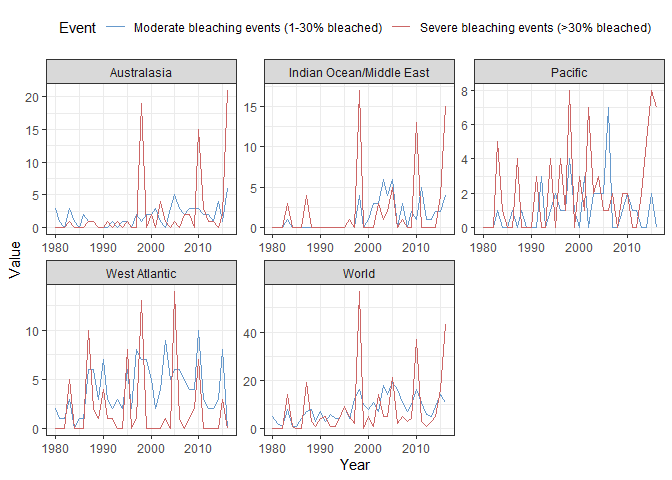

## Case Study #2: Coral Bleaching

Link to the data set I'm using:
<https://github.com/WJC-Data-Science/DTS350/raw/master/coral.csv>


### Number of coral bleaching events

```
## Warning: package 'tidyverse' was built under R version 4.1.3
```

```
## -- Attaching packages --------------------------------------- tidyverse 1.3.2 --
## v ggplot2 3.3.6     v purrr   0.3.4
## v tibble  3.1.8     v dplyr   1.0.9
## v tidyr   1.2.0     v stringr 1.4.1
## v readr   2.1.2     v forcats 0.5.2
```

```
## Warning: package 'ggplot2' was built under R version 4.1.3
```

```
## Warning: package 'tibble' was built under R version 4.1.3
```

```
## Warning: package 'tidyr' was built under R version 4.1.3
```

```
## Warning: package 'readr' was built under R version 4.1.3
```

```
## Warning: package 'purrr' was built under R version 4.1.3
```

```
## Warning: package 'dplyr' was built under R version 4.1.3
```

```
## Warning: package 'stringr' was built under R version 4.1.3
```

```
## Warning: package 'forcats' was built under R version 4.1.3
```

```
## -- Conflicts ------------------------------------------ tidyverse_conflicts() --
## x dplyr::filter() masks stats::filter()
## x dplyr::lag()    masks stats::lag()
## Rows: 370 Columns: 5
## -- Column specification --------------------------------------------------------
## Delimiter: ","
## chr (3): Entity, Code, Event
## dbl (2): Year, Value
## 
## i Use `spec()` to retrieve the full column specification for this data.
## i Specify the column types or set `show_col_types = FALSE` to quiet this message.
```

<!-- -->

This data shows that coral bleaching is becoming more frequent, as there are more large scale incidents with fewer years between them. 


### Number of coral bleaching events, Line Graph edition

<!-- -->

Personally, it made more sense for the data to be in a line graph than a bar graph, and for the moderate and severe data trends to be looked at separately, rather than as additions to each other. This data shows that while moderate coral bleaching appears to be steadily increasing over the world, severe bleaching comes in spikes, most likely related to some sort of ecological disaster. It would be more interesting to cross reference the severe spikes with various possible factors that would lead to coral bleaching.


Note that the `echo = FALSE` parameter was added to the code chunk to prevent printing of the R code that generated the plot.
